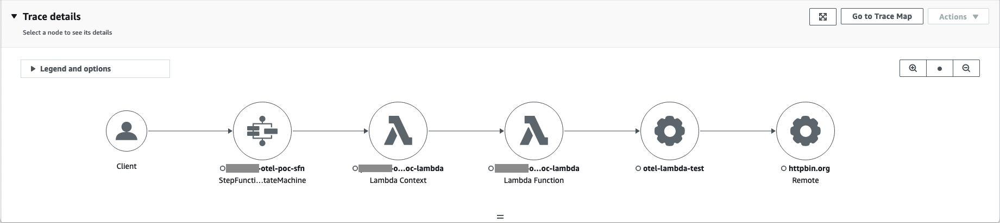

The Quarkus app makes use of the [`quarkus-amazon-lambda`](https://quarkus.io/guides/aws-lambda) extension and tests the OTel support.

The handler is: [`LambdaHandler`](src/main/java/org/acme/opentelemetry/lambda/LambdaHandler.java)

## Build

To build the app (in macOS):

```shell
mvn clean package -Dnative -DskipTests \
  -Dquarkus.native.container-build=true \
  -Dquarkus.native.builder-image=quay.io/quarkus/ubi-quarkus-mandrel-builder-image:jdk-17
```

## Deploy

To deploy, you can use terraform. Add (or uncomment) the relevant `local` variables in [variables.tf](terraform/variables.tf) file.

* Lambda's deployment config is in [lambda.tf](terraform/lambda.tf)
* SFN's config is in [sfn.tf](terraform/sfn.tf)

## Execute

To execute just run the [`execute_sfn.sh`](execute_sfn.sh) script from the repository root.

```shell
sfn_arn=[arn]
profile=[aws cli profile]
region=[current region]
./execute_sfn.sh $sfn_arn $profile $region
```

## Result


